# Plant Nursery Simulator — Final Report

**Design Patterns, Requirements, and System Overview**  
**Course:** COS214 (University of Pretoria)  
**Team:** The Tormentos  
**Date:** 2025-11-02  

## Table of Contents

1. [Research Brief: Nursery Domain Findings](#1-research-brief-nursery-domain-findings)
    1. [Plant Care and Growth Management](#11-plant-care-and-growth-management)
    2. [Staff Coordination and Task Flow](#12-staff-coordination-and-task-flow)
    3. [Customer Experience and Sales Workflow](#13-customer-experience-and-sales-workflow)
    4. [System Scalability and Data Management](#14-system-scalability-and-data-management)
    5. [Assumptions and Definitions](#15-assumptions-and-definitions)
    6. [References](#16-references)
2. [System Overview](#2-system-overview)
3. [Functional & Non-Functional Requirements](#3-functional--non-functional-requirements)
4. [Design Patterns Report](#4-design-patterns-report)
5. [GUI Requirements](#5-gui-requirements)
6. [Plant Lifecycle State Machine](#6-plant-lifecycle-state-machine)
7. [Pattern-to-Requirement Summary](#7-pattern-to-requirement-summary)
8. [Spec Compliance & Submission Checklist](#8-spec-compliance--submission-checklist)
9. [References](#9-references)

---

## 1. Research Brief: Nursery Domain Findings

The research phase examined how commercial nurseries operate across plant cultivation, staff coordination, and customer experience. Nurseries behave like living ecosystems where biological growth, human scheduling, and sales interactions constantly influence each other. Understanding those loops guided the simulator so that it mirrors the adaptability of a real operation while staying maintainable.

### 1.1 Plant care and growth management

* Nurseries manage diverse plant families (annuals, perennials, succulents, shrubs, trees) with distinct water, soil, nutrient, and sunlight profiles (Department of Agriculture, 2023; Royal Horticultural Society, 2022).
* Climate and irrigation systems must adjust on schedule to avoid stress across batches.
* **Insight applied:** Each `PlantInstance` owns pluggable watering and fertilising strategies (Strategy) so care algorithms can reflect cultivar differences. Lifecycle state transitions (Seed, Growing, Mature, Withering, Dead) capture that a plant responds differently to care depending on maturity (State). Health vitals and thresholds encode simplified horticultural rules that drive those transitions.

### 1.2 Staff coordination and task flow

* Nursery teams span growers, floor staff, cashiers, and logistics who need shared context (shift notes, stock changes, care alerts).
* Command batching and delegation help manage repetitive jobs (watering runs, pruning, order prep).
* **Insight applied:** Care requests become `Command` objects that staff can queue, undo, or audit; specialised handlers (Chain of Responsibility) route tasks to the right role. A `NurseryMediator` centralises communication so staff, inventory, and customer service modules interact without tight coupling.

### 1.3 Customer experience and sales workflow

* Differentiated service (bespoke potting, gift preparation, delivery) is a competitive lever (Garden Centre Magazine, 2024).
* Checkout systems shield customers from internal stock/database complexity.
* **Insight applied:** The `SalesFacade` offers a single entry point for the GUI and demo scripts, hiding payment, stock reservation, and notification details. The `OrderDirector` with a `CustomOrderBuilder` composes customised orders so optional features stay modular.

### 1.4 System scalability and data management

* Nurseries expand by adding greenhouse sections, experimenting with cultivars, and switching record formats as partners demand (CSV exports, plain text manifests).
* **Insight applied:** A composite greenhouse structure lets controllers treat beds and individual plants uniformly and extend the hierarchy as the site grows. Plant prototypes are stored in a registry so new cultivars can be cloned without revisiting construction code (Prototype). CSV and TXT file formats are supported through adapters, insulating inventory logic from I/O changes (Adapter). Observer links keep UI widgets and stock records in sync when a plant changes availability.

### 1.5 Assumptions and definitions

* Plants are modelled with core vitals (health, water, nutrients, sunlight preference) rather than biological precision; simulation ticks abstract real-time growth.
* Customer preferences focus on order customisation features exposed through the builder (pot, wrapping, delivery); financials remain high level.
* The nursery operates in a controlled climate so environmental factors enter via strategies and state thresholds instead of free-form physics.

### 1.6 References

* Department of Agriculture. (2023). *Greenhouse Management and Plant Propagation Guide.* Pretoria.
* Royal Horticultural Society. (2022). *Plant Care Best Practices.* London.
* Garden Centre Magazine. (2024). *Trends in Customer Personalisation and Retail Nurseries.*

---

## 2. System Overview

The Plant Nursery Simulator models a nursery business end-to-end:

* **Greenhouse:** Plants are organised in a **Composite** of beds and leaves. A **Greenhouse Iterator** traverses all plants in depth-first order to apply periodic growth ticks and care.
* **Plants and lifecycle:** Each plant instance holds vitals (health, water, nutrients) and a lifecycle **State** (Seed → Growing → Mature → Withering → Dead). States encapsulate per-stage behaviour; **Strategy** objects (watering, fertilising) update vitals.
* **Observation:** Plants are **Subjects** and notify **Observers** (Staff, StockItem) about care needs and availability changes.
* **Inventory and sales:** Inventory maintains `StockItem`s (some linked to `PlantInstance`). **SalesFacade** orchestrates sales, orders, inventory updates, and uses the **Builder** to assemble orders.
* **Persistence:** **Adapter**s (CSV/TXT) abstract I/O so Inventory remains independent of file formats.
* **Operations:** Care actions are **Commands** queued and executed by Staff; care requests route through a **Chain of Responsibility**; Customer/Staff communication goes via a **Mediator**.

---

## 3. Functional & Non-Functional Requirements

### 3.1 Functional Requirements (FR)

1. **FR1.** Register clonable plant prototypes by name. *(Prototype)*
2. **FR2.** Create plants by cloning a registered prototype. *(Prototype)*
3. **FR3.** Model plant lifecycle states and transitions during growth ticks. *(State)*
4. **FR4.** Mark a plant as available for sale when market-ready. *(State)*
5. **FR5.** Define interchangeable watering strategies and execute per plant. *(Strategy)*
6. **FR6.** Define interchangeable fertilising strategies and execute per plant. *(Strategy)*
7. **FR7.** Allow changing strategies at runtime per plant instance. *(Strategy)*
8. **FR8.** Provide a file I/O abstraction for inventory. *(Adapter Target)*
9. **FR9.** Load and save inventory via pluggable adapters (CSV, TXT). *(Adapter)*
10. **FR10.** Organise plants in a composite greenhouse hierarchy. *(Composite)*
11. **FR11.** Cascade care operations through the greenhouse hierarchy. *(Composite)*
12. **FR12.** Provide an iterator to traverse plants in a bed hierarchy. *(Iterator)*
13. **FR13.** Plants act as subjects that notify observers of events. *(Observer)*
14. **FR14.** Staff and stock items observe plants and react to events. *(Observer)*
15. **FR15.** Expose an aggregate interface for inventory iterators. *(Iterator Aggregate)*
16. **FR16.** Iterate over inventory items for browsing and sales. *(Iterator)*
17. **FR17.** Maintain and query inventory (add, remove, count, lookup).
18. **FR18.** Encapsulate plant care actions as commands. *(Command)*
19. **FR19.** Staff queue and invoke plant care commands. *(Command)*
20. **FR20.** Route care requests through a chain of responsibility. *(CoR)*
21. **FR21.** Each care handler processes or delegates. *(CoR)*
22. **FR22.** Coordinate communication between colleagues via mediator. *(Mediator)*
23. **FR23.** Customers and staff send/receive messages via mediator. *(Mediator)*
24. **FR24.** Build orders using a builder and optional director. *(Builder)*
25. **FR25.** Provide a unified façade for sales operations. *(Facade)*
26. **FR26.** Execute periodic growth ticks across all plants. *(Controller + Iterator)*
27. **FR27.** Keep stock availability in sync with plant readiness. *(Observer)*

### 3.2 Non-Functional Requirements (NFR)

* **NFR1 (Scalability, Performance).** Traversal and growth ticks scale linearly with plant count (O(n)).
* **NFR2 (Performance).** Growth tick uses bounded constant-time updates per plant.
* **NFR3 (Reliability).** Observers never access destroyed subjects; shutdown is communicated.
* **NFR4 (Extensibility).** New strategies, states, handlers, iterators, adapters, and commands can be added without modifying client code.
* **NFR5 (Usability, Maintainability).** Sales interactions simplified through a single façade.
* **NFR6 (Portability, Maintainability).** Persistence adaptable to multiple file formats without changing inventory logic.
* **NFR7 (Documentation).** Core components documented and organised for Doxygen generation.
* **NFR8 (Testability, Maintainability).** Interfaces and separation of concerns support unit testing.

---

## 4. Design Patterns Report

> Each section lists intent, rationale, where implemented (headers in `include/`, implementations in `src/`), participants, key interactions, FR mapping, and efficiency notes.

### Iterator — Inventory

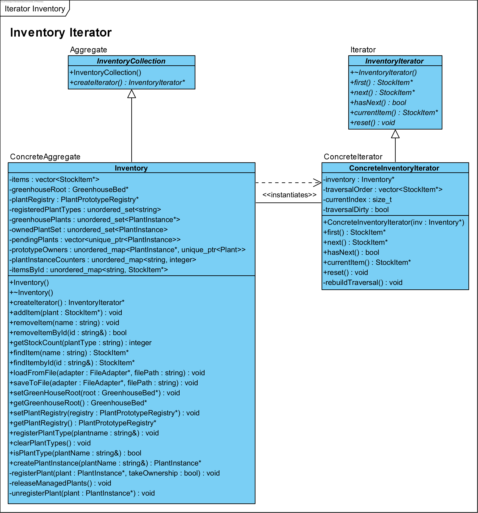

* **Intent & rationale:** Uniform traversal over inventory without exposing containers; enforce business ordering.
* **Where:** `InventoryCollection.h`, `InventoryIterator.h`, `ConcreteInventoryIterator.*`, `Inventory.*`
* **Participants:** `InventoryIterator` (Iterator), `ConcreteInventoryIterator` (ConcreteIterator), `InventoryCollection` (Aggregate), `Inventory` (ConcreteAggregate)
* **Key interactions:** `Inventory::createIterator()` → `hasNext()/next()`
* **FRs:** FR15, FR16
* **Efficiency:** O(n) rebuild; lazy recalculation.

### Iterator — Greenhouse

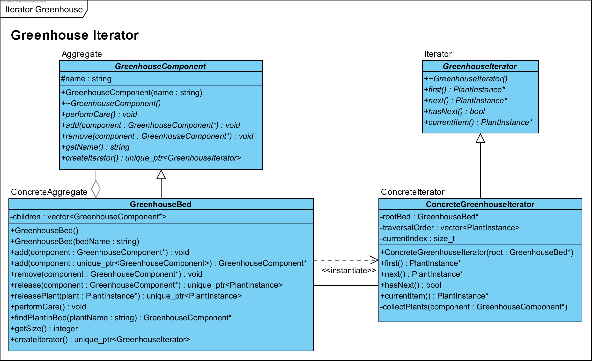

* **Intent & rationale:** Traverse Composite greenhouse without coupling traversal to structure.
* **Where:** `GreenhouseIterator.h`, `ConcreteGreenhouseIterator.*`, `GreenhouseComponent.h`, `GreenhouseBed.*`, `GreenhouseController.*`
* **Participants:** `GreenhouseIterator`, `ConcreteGreenhouseIterator`, `GreenhouseComponent`, `GreenhouseBed`
* **Key interactions:** Controller requests iterator and applies growth ticks.
* **FRs:** FR12, FR26
* **Efficiency:** DFS collection; O(n) iteration.

### Composite — Greenhouse Structure

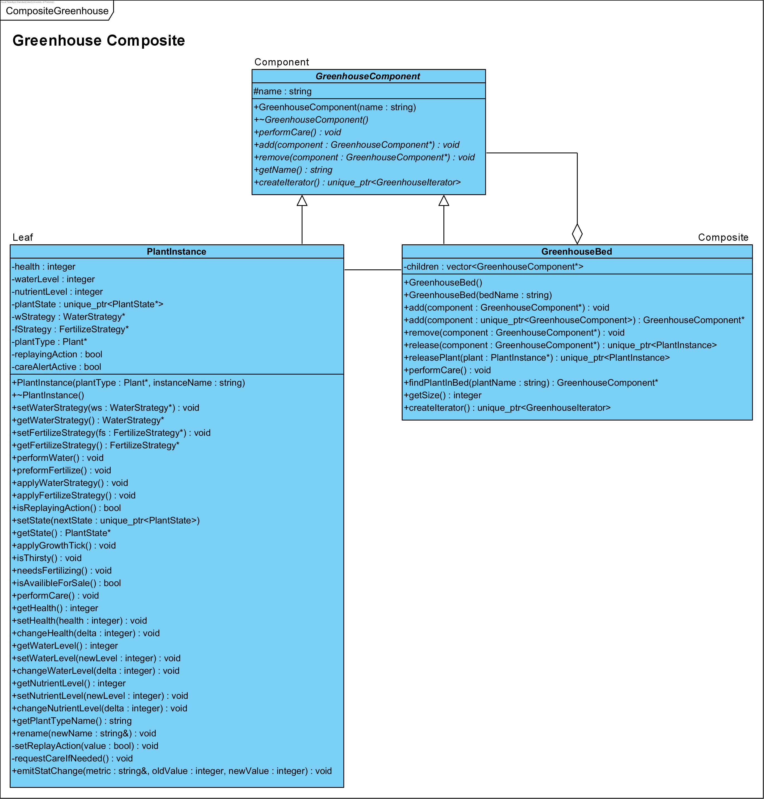

* **Intent & rationale:** Part–whole hierarchy of beds and plants; uniform operations.
* **Where:** `GreenhouseComponent.h`, `GreenhouseBed.*`, `PlantInstance.*`
* **Participants:** Component (`GreenhouseComponent`), Composite (`GreenhouseBed`), Leaf (`PlantInstance`)
* **Key interactions:** `performCare()` cascades from composite to leaves.
* **FRs:** FR10, FR11, FR26
* **Efficiency:** Single-pass cascades; safe ownership.

### Facade — Sales

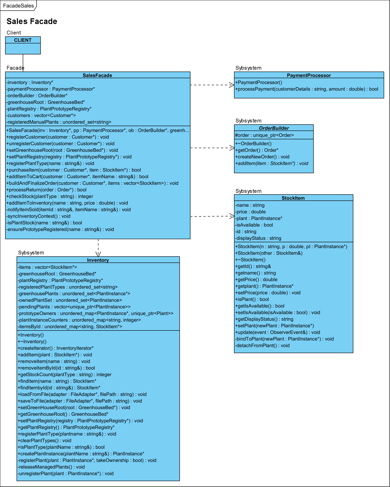

* **Intent & rationale:** Single entry point for sales operations decoupling UI from subsystems.
* **Where:** `SalesFacade.*` (+ `Inventory`, `PaymentProcessor`, `OrderBuilder`)
* **FRs:** FR25
* **Efficiency:** O(1) orchestration per item.

### Builder — Orders

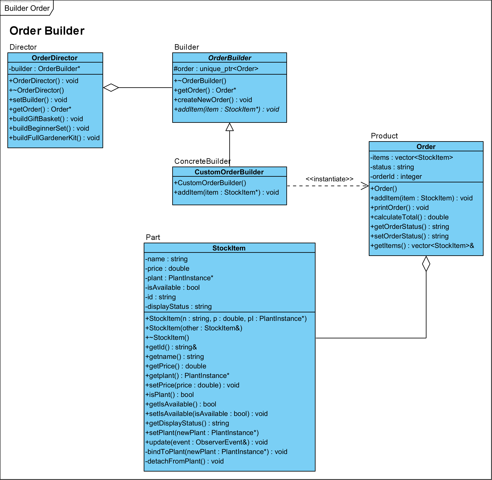

* **Intent & rationale:** Step-by-step construction of complex orders via director presets.
* **Where:** `Order.*`, `OrderBuilder.h`, `CustomOrderBuilder.*`, `OrderDirector.*`
* **Participants:** Product (`Order`), Builder (`OrderBuilder`), ConcreteBuilder (`CustomOrderBuilder`), Director (`OrderDirector`)
* **FRs:** FR24
* **Efficiency:** Linear in item count.

### Observer — Plants, Staff, Stock Items

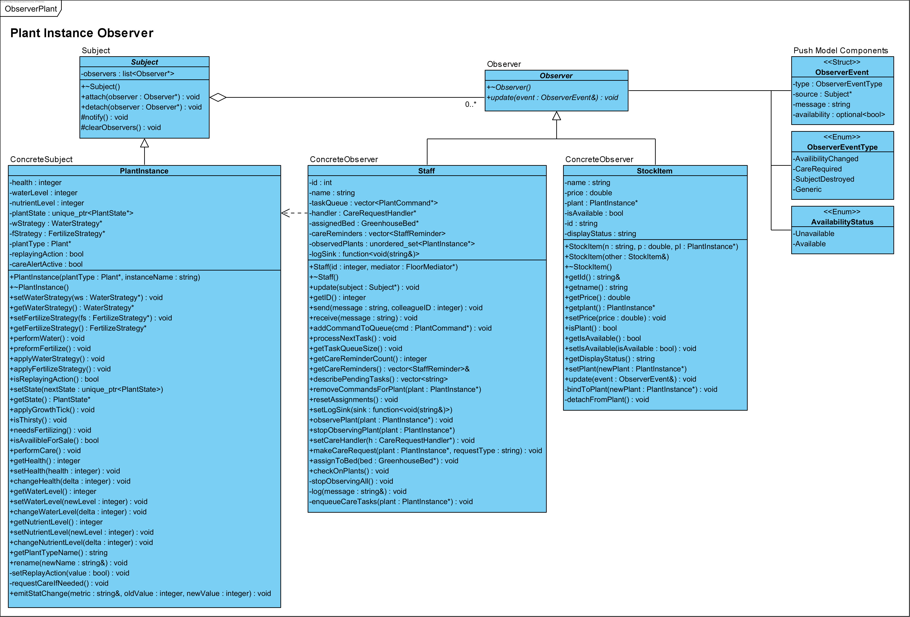

* **Intent & rationale:** Decouple plant events from staff reminders and storefront availability.
* **Where:** `Observer.h`, `Subject.*`, `Staff.*`, `StockItem.*`, `PlantInstance.*`
* **Participants:** Subject (`PlantInstance`), Observer (`Staff`, `StockItem`)
* **FRs:** FR13, FR14, FR27
* **Model:** Push-model notifications; snapshot payloads.

### Adapter — Inventory File I/O

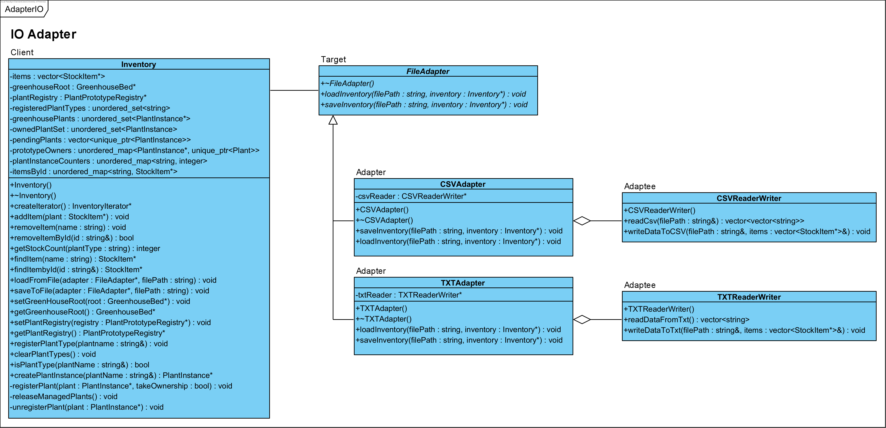

* **Intent & rationale:** Pluggable CSV/TXT I/O without changing inventory logic.
* **Where:** `FileAdapter.h` (Target), `CSVReaderWriter.*` / `TXTReaderWriter.*` (Adaptees), `CSVAdapter.*` / `TXTAdapter.*` (Adapters); `Inventory` uses `FileAdapter`.
* **FRs:** FR8, FR9
* **Efficiency:** Single-pass encode/decode; streams via iterators.

### Prototype — Plants and Registry

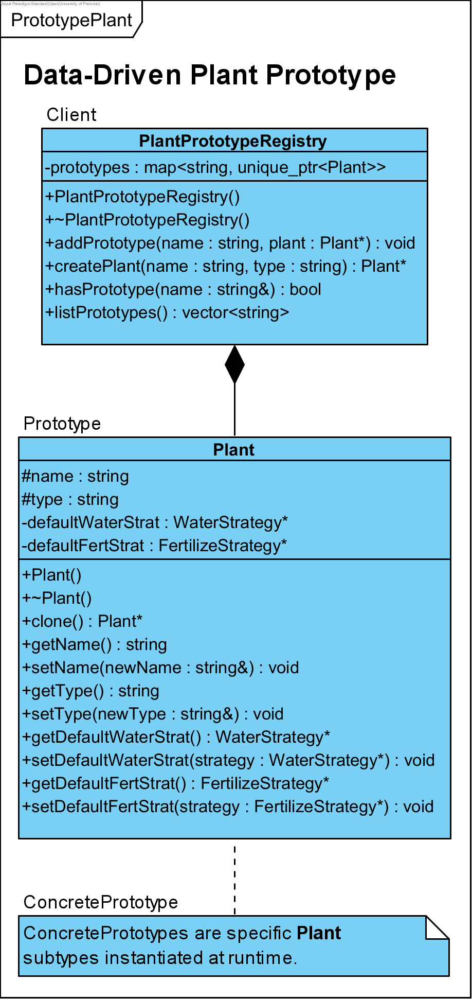

* **Intent & rationale:** Data-driven creation of plant types by cloning prototypes.
* **Where:** `Plant.*` (`clone()`), `PlantPrototypeRegistry.*`
* **FRs:** FR1, FR2
* **Efficiency:** O(1) clone; avoids central factories.

### State — Plant Lifecycle

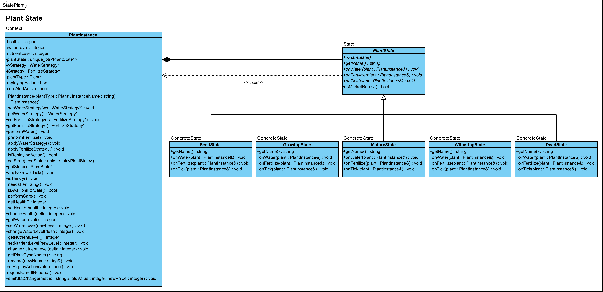

* **Intent & rationale:** Encapsulate lifecycle behaviour and transitions.
* **Where:** `PlantState.h`, concrete states (Seed/Growing/Mature/Withering/Dead), helpers (`PlantStateUtils`, `PlantStateThresholds`); `PlantInstance` delegates.
* **FRs:** FR3, FR4
* **Efficiency:** Constant-time per tick per plant.

### Command — Plant Care Tasks

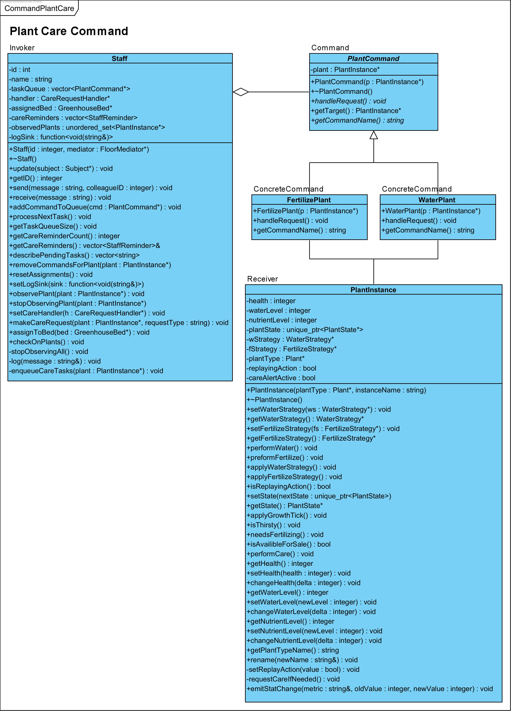

* **Intent & rationale:** Encapsulate care actions (water, fertilise) queued by staff.
* **Where:** `PlantCommand.h`, `WaterPlant.*`, `FertilizePlant.*`; receiver `PlantInstance`; invoker `Staff`.
* **FRs:** FR18, FR19
* **Efficiency:** O(1) enqueue/dequeue.

### Mediator — Floor Coordination

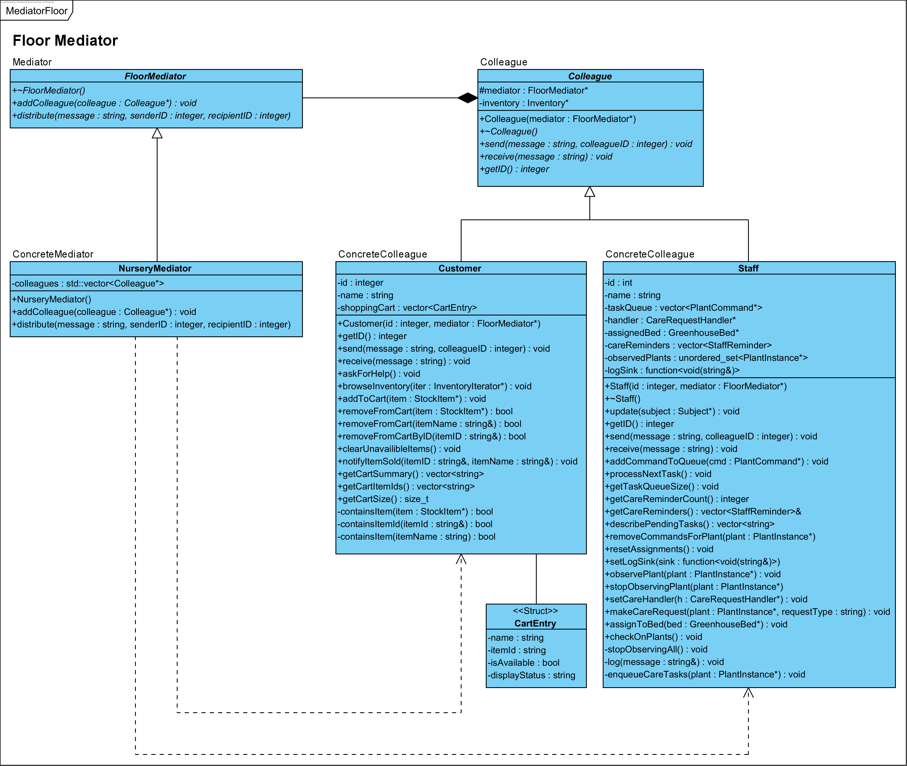

* **Intent & rationale:** Centralise communication among colleagues to reduce coupling.
* **Where:** `FloorMediator.h`, `NurseryMediator.*`; `Colleague` base; `Customer`/`Staff`.
* **FRs:** FR22, FR23
* **Efficiency:** O(m) broadcast; O(1) targeted.

### Chain of Responsibility — Care Routing

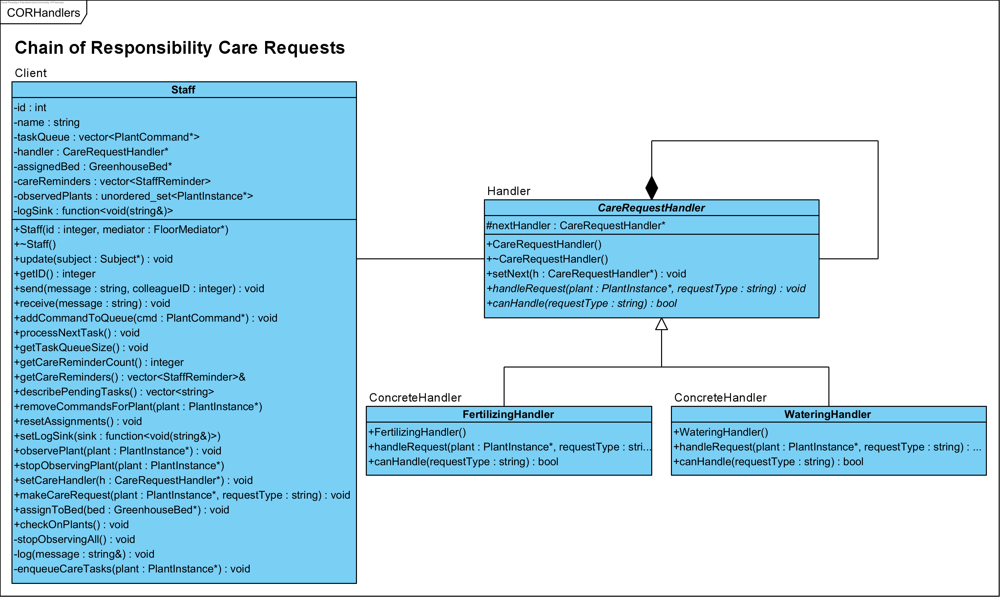

* **Intent & rationale:** Route care requests through handlers; easy extensibility.
* **Where:** `CareRequestHandler.h`, `WateringHandler.*`, `FertilizingHandler.*`; wired by `Staff`.
* **FRs:** FR20, FR21
* **Efficiency:** O(h) worst case where h is handler depth.

### Strategy — Watering and Fertilising

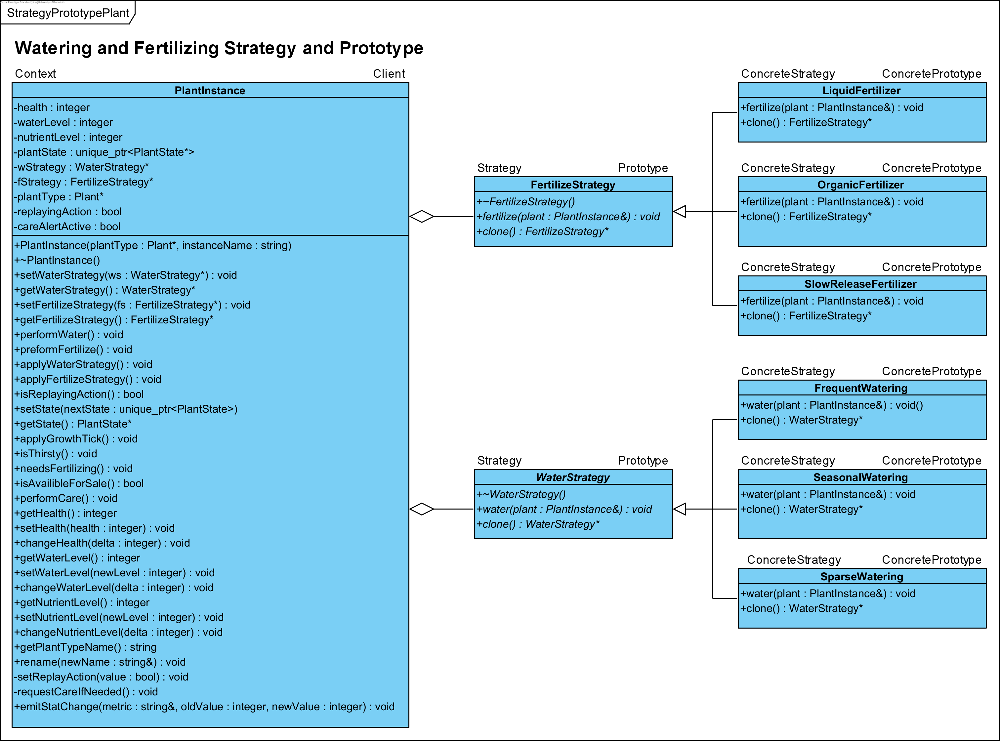

* **Intent & rationale:** Swap care algorithms at runtime; optional prototyped presets.
* **Where:** `WaterStrategy.h`, `FertilizeStrategy.h`; concrete strategies; used by `PlantInstance`.
* **FRs:** FR5, FR6, FR7
* **Efficiency:** Direct virtual dispatch; O(1) swaps.

---

## 5. GUI Requirements

**Goal:** ensure each subsystem (sales, inventory, greenhouse, staff, adapters, prototype registry, lifecycle management) is accessible and clear.

### 5.1 Home Dashboard

* Summary of inventory levels, recent sales, care alerts, greenhouse health.
* Notification panel fed by observer events (`SubjectDestroyed`, `CareRequired`, `AvailabilityChanged`).

### 5.2 Greenhouse Visualisation

* Browse Composite hierarchy of beds and plants; inspect vitals; trigger care commands.
* Assign staff and observer subscriptions; colour-coded lifecycle badges.

### 5.3 Plant Lifecycle Monitor

* Visualise the state machine and thresholds; simulate growth ticks; replay care actions.

### 5.4 Inventory Management

* View/edit stock; add/remove items; register plant types; filter by availability and location.

### 5.5 File Import & Export (Adapters)

* Import TXT/CSV with preview and validation; export current snapshot with format selector.

### 5.6 Sales & Customer Operations (Facade)

* Carts, purchases, custom orders via builder, returns processing, quick stock checks.

### 5.7 Prototype Registry & Plant Templates

* Manage prototypes and default strategies; spawn plant instances.

### 5.8 Staff & Task Management

* Roster view, reminder inbox, command queues, CoR care requests, mediator messaging.

### 5.9 Care Strategy Management

* Configure strategies and assign to plants/prototypes; preview effects.

### 5.10 Order & Return History

* Log of orders with statuses; search/filter; export; return processing.

### 5.11 System Administration

* Configure adapters, greenhouse roots, registries; diagnostics and sync tools.

### 5.12 Error Handling & Notifications

* Surface adapter errors, payment failures, missing prototypes; actionable resolutions.

---

## 6. Plant Lifecycle State Machine

Each `PlantInstance` owns a polymorphic `PlantState` responsible for reacting to watering, fertilising, and tick events. Configured **Strategies** are executed through the state layer, allowing behaviour that adapts as the plant progresses.

**Shared concepts**

* Unique ownership of active state via `std::unique_ptr<PlantState>`; observers receive `SubjectDestroyed` on teardown.
* Strategies invoked within state hooks; *promotion replays* run the new state exactly once with guards.
* Resource stress and recovery thresholds drive transitions; observer notifications on availability changes.

**Seed**

* Care boosts resources and health; tick penalises low resources.
* Transitions: → **Growing** when thresholds met; → **Dead** on critical health.

**Growing**

* Care applies strategies; tick gains health if resources healthy or loses otherwise.
* Transitions: → **Withering** on stress; → **Mature** on thresholds; → **Dead** on critical health.

**Mature**

* Care applies strategies modestly; tick slight decline or sharper under stress.
* Transitions: → **Withering** on stress/low health; → **Dead** on critical health.

**Withering**

* Care provides strong recovery; tick degrades health until rescued or dead.
* Transitions: → **Dead** on critical; → **Mature/Growing** on recovery.

**Dead**

* No-ops; terminal.

**Promotion replays**

* Actions that cause a state change replay once on the new state; guards prevent double application.

**Health adjustments & testing**

* Values clamped 0..100; unit tests verify lifecycle and replay correctness.

---

## 7. Pattern-to-Requirement Summary

* **Prototype (Plants):** FR1, FR2
* **State (Lifecycle):** FR3, FR4
* **Strategy (Water/Fertilise):** FR5, FR6, FR7
* **Adapter (I/O):** FR8, FR9
* **Composite (Greenhouse):** FR10, FR11, FR26
* **Iterator (Greenhouse):** FR12, FR26
* **Observer (Plants/Staff/Stock):** FR13, FR14, FR27
* **Iterator (Inventory):** FR15, FR16
* **Command (Care):** FR18, FR19
* **Chain of Responsibility:** FR20, FR21
* **Mediator (Floor):** FR22, FR23
* **Builder (Orders):** FR24
* **Facade (Sales):** FR25

---

## 8. Spec Compliance & Submission Checklist

* ≥ **10 design patterns** used; at least two of each (creational/structural/behavioural).
* **Diagrams in Visual Paradigm:** Class, State, Activity, Sequence, Object, Communication (+ high-level Activity).
* **Doxygen** used to generate code documentation; headers include docblocks.
* **Git & GitHub:** branching strategy documented; ≥10 commits per member; ≥3 closed PRs.
* **Automated unit tests** implemented; core flows covered (iterators, state transitions, adapters, facade).
* *(Bonus)* **GitHub Actions** for lint, test, build; *(Bonus)* **GUI** implementation.
* **Repository content:** `/src`, `/include`, `/docs` (Doxygen), `/Report` (PDF), `/data` (optional), `tests/`, `README.md`, `Makefile`, `Doxyfile`, plus ClickUp/Fitchfork submission as per spec.

---

## 9. References

* Department of Agriculture. (2023). *Greenhouse Management and Plant Propagation Guide.* Pretoria.
* Royal Horticultural Society. (2022). *Plant Care Best Practices.* London.
* Garden Centre Magazine. (2024). *Trends in Customer Personalisation and Retail Nurseries.*
